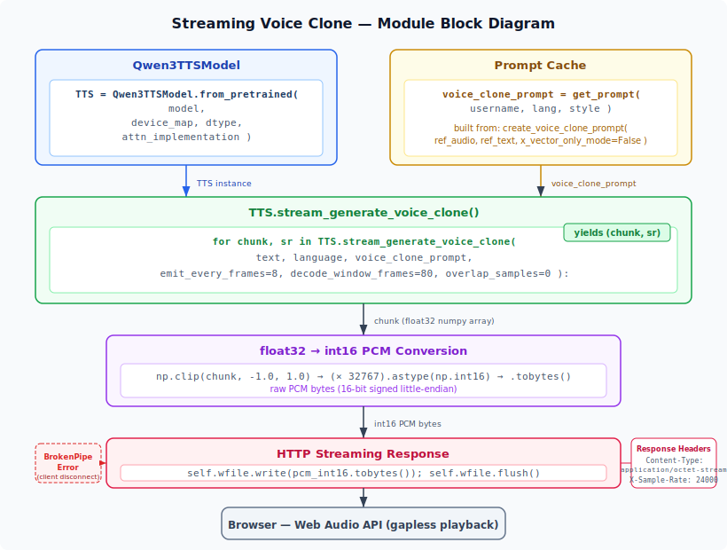

# Qwen3-TTS Voice Clone Streaming Server — Implementation Description

## How to Run

```bash
conda activate qwen3-tts
python server.py --model Qwen/Qwen3-TTS-12Hz-1.7B-Base
```

Available options:

| Option | Default | Description |
|---|---|---|
| `--host` | `0.0.0.0` | Bind address |
| `--port` | `8888` | Port number |
| `--model` | `Qwen/Qwen3-TTS-12Hz-1.7B-Base` | TTS model path or HuggingFace repo ID |
| `--device` | `cuda:0` | GPU device |
| `--dtype` | `bfloat16` | Inference precision (`bfloat16` / `float16` / `float32`) |
| `--no-flash-attn` | ― | Disable Flash Attention 2 |
| `--translate-model` | `Qwen/Qwen3-8B` | Translation model (set to `none` to disable) |
| `--translate-device` | same as `--device` | Device for the translation model |

To expose externally, use cloudflared:

```bash
cloudflared tunnel --url http://localhost:8888
```

---

## 1. System Overview

This system is a web application that provides browser-based access to the Voice Clone capabilities of the Qwen3-TTS model. It consists of a lightweight HTTP server (`server.py`) built on Python's standard library `http.server`, and a single-file frontend (`server.html`).

Key features:

- **Streaming speech synthesis**: Sends the model's incremental output as HTTP chunked responses and plays them in real time via the Web Audio API
- **Voice Clone**: Speaker feature extraction from reference audio, with synthesis across 4 styles (neutral / bright / calm / angry) × 3 languages (Japanese / English / Chinese)
- **Automatic translation pipeline**: When the ASR input language differs from the output language, machine translation via Qwen3-8B is automatically inserted
- **Performance instrumentation**: Collects percentile statistics for generation, streaming, and translation operations

---

## 2. Server-Side Implementation (`server.py`)

### Module Block Diagram



### 2.1 Model Loading and Initialization

At startup, two models are loaded onto the GPU: the TTS model (via the `Qwen3TTSModel` wrapper) and the translation model (via HuggingFace `AutoModelForCausalLM`).

```python
# TTS model loading (server.py L718-726)
TTS = Qwen3TTSModel.from_pretrained(
    args.model,
    device_map=args.device,
    dtype=dtype_map[args.dtype],
    attn_implementation=attn,
)
MODEL_KIND = getattr(TTS.model, "tts_model_type", "base")
```

```python
# Translation model loading (server.py L732-738)
TRANSLATOR_TOKENIZER = AutoTokenizer.from_pretrained(args.translate_model)
TRANSLATOR_MODEL = AutoModelForCausalLM.from_pretrained(
    args.translate_model,
    torch_dtype=dtype_map[args.dtype],
    device_map=tr_device,
)
TRANSLATOR_MODEL.eval()
```

Key point: Flash Attention 2 usage is controlled by the `--no-flash-attn` flag, allowing a trade-off between inference speed and VRAM consumption. The translation model can be disabled with `--translate-model none`.

### 2.2 Reference Audio Management and Prompt Cache

The voice clone prompt (a structure containing speaker feature vectors) is lazily built on first use and cached in memory thereafter. The on-disk layout is `./references/{username}/{lang}/{style}.wav`.

```python
# Lazy prompt construction (server.py L277-291)
def get_prompt(username: str, lang: str, style: str):
    """Return cached prompt, building it lazily from REFERENCE_PATHS if needed."""
    key = _cache_key(username, lang, style)
    if key in PROMPT_CACHE:
        return PROMPT_CACHE[key]
    wav_path = REFERENCE_PATHS.get(key)
    if wav_path is None:
        return None
    print(f"[cache] Building prompt for {key} (first use) ...")
    t0 = time.time()
    items = _build_prompt(wav_path, lang, style)
    PROMPT_CACHE[key] = items
    elapsed = time.time() - t0
    print(f"[cache] {key} OK ({elapsed:.2f}s)")
    return items
```

The core of prompt construction is the call to `create_voice_clone_prompt`, which extracts speaker features such as x-vectors from the reference audio and its transcript (ref_text).

```python
# Voice clone prompt generation (server.py L240-248)
def _build_prompt(wav_path: str, lang: str, style: str):
    ref_text = REF_TEXTS[lang][style]
    items = TTS.create_voice_clone_prompt(
        ref_audio=str(wav_path),
        ref_text=ref_text,
        x_vector_only_mode=False,
    )
    return items
```

Key point: Setting `x_vector_only_mode=False` includes the full reference audio context in the prompt, not just the x-vector. Each style has a predefined reference text (`REF_TEXTS`) that reflects the target emotion and tone.

### 2.3 Non-Streaming Speech Synthesis (`/api/generate`)

This endpoint generates the entire waveform at once and returns it as a WAV file. It is retained for debugging purposes and is not used by the frontend.

```python
# Batch generation (server.py L589-603)
t0 = time.time()
wavs, sr = TTS.generate_voice_clone(
    text=text,
    language=model_language,
    voice_clone_prompt=prompt_items,
)
elapsed = time.time() - t0
elapsed_ms = elapsed * 1000
PERF_GENERATE.record(elapsed_ms)
duration = len(wavs[0]) / sr
self._send_wav(wavs[0], sr)
```

The response is sent as `audio/wav`. The client is blocked until all samples have been generated, resulting in noticeable latency for longer texts.

### 2.4 Streaming Speech Synthesis (`/api/generate_stream`)

This is the core feature of the system. By sending the model's incremental output as HTTP response chunks, playback can begin before generation is complete.

```python
# Streaming generation — header transmission (server.py L635-640)
self.send_response(200)
self.send_header("Content-Type", "application/octet-stream")
self.send_header("X-Sample-Rate", "24000")
self.send_header("Cache-Control", "no-cache")
self.send_header("Connection", "close")
self.end_headers()
```

Key point: The Content-Type is `application/octet-stream` (raw PCM byte stream) with no WAV header. The sample rate is conveyed via the custom header `X-Sample-Rate`. This allows streaming transmission of data whose total length is unknown at the time headers are sent.

```python
# Streaming generation — chunk loop (server.py L648-667)
for chunk, sr in TTS.stream_generate_voice_clone(
    text=text,
    language=model_language,
    voice_clone_prompt=prompt_items,
    emit_every_frames=8,
    decode_window_frames=80,
    overlap_samples=0,
):
    if t_first is None:
        t_first = time.time()

    # Convert float32 -> int16 PCM bytes
    pcm_int16 = np.clip(chunk, -1.0, 1.0)
    pcm_int16 = (pcm_int16 * 32767).astype(np.int16)
    self.wfile.write(pcm_int16.tobytes())
    self.wfile.flush()
    chunk_count += 1
    total_samples += len(chunk)
```

Key parameters:

| Parameter | Value | Description |
|---|---|---|
| `emit_every_frames` | 8 | Emit a chunk every 8 frames |
| `decode_window_frames` | 80 | Decode window width (in frames) |
| `overlap_samples` | 0 | No overlap between chunks |

Key point: The model outputs float32 waveforms, which are clipped and converted to int16 before being flushed to the network immediately via `wfile.flush()`. Client disconnection is handled gracefully through `BrokenPipeError` handling.

### 2.5 Translation Pipeline (`/api/translate`)

Provides text translation using Qwen3-8B.

```python
# Translation prompt construction and inference (server.py L320-356)
messages = [
    {
        "role": "system",
        "content": (
            f"You are a professional translator. "
            f"Translate the following {in_name} text into natural, fluent {out_name}. "
            f"Output ONLY the translated text, no explanations."
        ),
    },
    {"role": "user", "content": src},
]

text_input = TRANSLATOR_TOKENIZER.apply_chat_template(
    messages, tokenize=False, add_generation_prompt=True,
    enable_thinking=False,  # disable Qwen3 thinking mode
)
```

Key point: `enable_thinking=False` disables Qwen3's thinking mode (`<think>` tag output) to produce only the translated text. As a safety measure, any residual `<think>` tags are stripped via regex post-processing.

```python
# Safety removal of <think> tags (server.py L354)
result = re.sub(r'<think>.*?</think>', '', result, flags=re.DOTALL).strip()
```

### 2.6 Performance Statistics (`PerfStats`)

A thread-safe class that accumulates timing measurements and provides percentile statistics.

```python
# Performance statistics class (server.py L36-128)
class PerfStats:
    """Thread-safe accumulator for timing measurements with percentile stats."""

    def __init__(self, name: str):
        self.name = name
        self._lock = threading.Lock()
        self._times: list[float] = []  # in ms

    def record(self, elapsed_ms: float):
        with self._lock:
            self._times.append(elapsed_ms)
```

Four trackers are defined:

```python
# Tracked operations (server.py L132-135)
PERF_GENERATE     = PerfStats("generate")          # batch generation
PERF_STREAM_TOTAL = PerfStats("stream_total")       # streaming total
PERF_STREAM_FIRST = PerfStats("stream_first_chunk") # first chunk latency
PERF_TRANSLATE    = PerfStats("translate")           # translation
```

Statistics are available as JSON via the `/api/stats` endpoint, including mean, standard deviation, and P50/P75/P90/P95/P99 percentiles.

---

## 3. Frontend (`server.html`)

A single HTML file with inline CSS and JavaScript, structured as an SPA. Key features:

- **Reference audio registration UI**: Upload audio via an accordion organized by username × language × style. Registration status is color-coded in three levels (done / partial / none), and the section auto-collapses when all styles are registered
- **Speech synthesis UI**: Select user, style, and output language, then enter text and press Generate
- **Streaming playback**: Receives raw int16 PCM from the server via `ReadableStream` and plays it gaplessly using Web Audio API (`BufferSource` chaining). After completion, all samples are merged into a WAV Blob and set on an `<audio>` element for replay and seeking
- **ASR (Automatic Speech Recognition)**: Browser-native voice input via Web Speech API (`continuous` + `interimResults`). Auto-triggers Generate when the user manually stops recording
- **Smart Generate**: When the ASR input language differs from the output language, automatically inserts a server-side translation API call before streaming generation. Translation results are shown via toast notifications
- **State persistence**: Username is stored in IndexedDB and automatically restored on revisit

---

## 4. Overall Data Flow

```
[Browser]                              [Server (server.py)]
    |                                        |
    |  1. GET /api/info                      |
    |--------------------------------------->|  Model info & cached key list
    |<---------------------------------------|
    |                                        |
    |  2. POST /api/upload_reference         |
    |  (wav_base64, username, lang, style)   |
    |--------------------------------------->|  Save WAV -> build prompt -> cache
    |<---------------------------------------|
    |                                        |
    |  3. GET /api/translate?src=...         |
    |--------------------------------------->|  Translate via Qwen3-8B
    |<---------------------------------------|
    |                                        |
    |  4. POST /api/generate_stream          |
    |  (username, style, text, ...)          |
    |--------------------------------------->|  Retrieve prompt (cache or lazy build)
    |                                        |  -> stream_generate_voice_clone()
    |  <--- int16 PCM chunk 1 -------------- |  <- every emit_every_frames=8
    |  <--- int16 PCM chunk 2 -------------- |
    |  <--- int16 PCM chunk N -------------- |
    |                                        |
    |  [Gapless playback via Web Audio API]  |
    |  [Build WAV Blob -> <audio> on done]   |
```

---

## 5. Design Decisions Summary

| Aspect | Decision | Rationale |
|---|---|---|
| Protocol | Raw PCM over HTTP | No WAV header needed; enables streaming with unknown total length |
| Sample rate | Custom header `X-Sample-Rate` | PCM has no metadata; sample rate must be conveyed out-of-band |
| Prompt cache | Lazy build + in-memory cache | Reduces startup time; only a few seconds of build cost on first access |
| Client playback | Web Audio API `BufferSource` chaining | Gapless, low-latency chunk playback |
| WAV reconstruction | Merge all chunks -> Blob URL | Enables seeking and replay after streaming completes |
| ASR -> Translation -> TTS | Unified Smart Generate pipeline | One-click voice clone across languages |
| Translation model | `enable_thinking=False` | Suppresses unnecessary thinking output; balances accuracy and speed |
